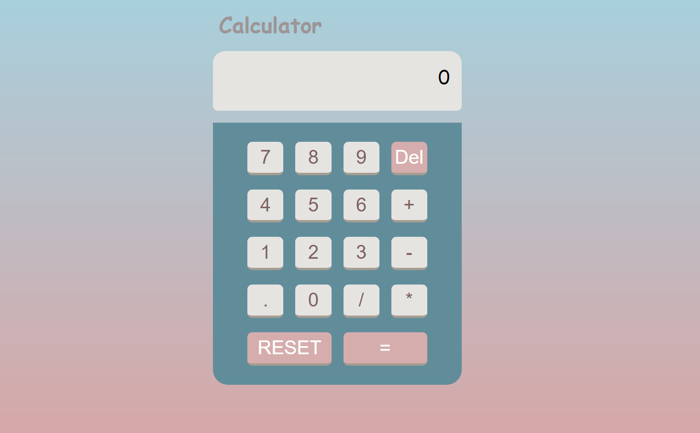

# About the Project:
 Calculator , a simple calculator application , I did it for the freecodecamp frontend project.

 [Live Demo](https://calculator-vert-two.vercel.app/)

 

 ## Technologies Used:
 1. React
 2. SCSS
